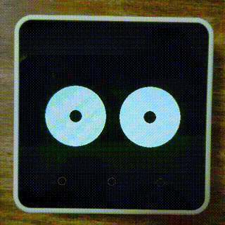

# Overview / 概要

The m5core2_eyes project displays touch-tracking eyes on the [M5Stack Core 2](https://docs.m5stack.com/#/en/core/core2), inspired by the nostalgic xeyes.

\[日本語\]

m5core2_eyesは、 [M5Stack Core 2](https://docs.m5stack.com/#/en/core/core2) の画面上のタッチを見つめる目を表示する、あの懐かしいxeyes風のソフトウェアです。

# Video / 動画



# Motivation / 開発のきっかけ

The M5Stack Core 2 offers a compelling combination of features: a compact, cute design, an intuitive touchscreen, and an integrated accelerometer. My motivation was to build interesting content that utilizes these unique aspects of the M5Stack. As I pondered ideas, I was reminded of xeyes—that wonderfully nostalgic program where animated eyes followed your mouse cursor. This sparked an idea: why not bring that same playful concept to the M5Stack, and even enhance it with the accelerometer? This resulted in a project where two digital eyes on its screen playfully follow your touches and even spin around when you give the M5Stack a gentle tap.

\[日本語\]

M5Stack Core2は、コンパクトでかわいらしいデザイン、直感的に操作できるタッチスクリーン、そして加速度センサーを内蔵しているなど、魅力的な機能が揃ったデバイスです。私は、こうしたM5Stackの特徴を活かした面白いコンテンツを作りたいと思いました。そんなときに思い出したのが「xeyes」です。マウスカーソルを追いかけるアニメーションの目が印象的な、懐かしいプログラムです。私は、この遊び心のある発想をM5Stackで再現し、さらに加速度センサーで進化させたら面白いのでは？と思いました。こうして、タッチに合わせて目が動き、軽くトンと叩くと目を回す、遊び心あふれる「デジタルの目」が誕生しました。

# Installation / インストール

1. Clone the repository:
    ```sh
    git clone https://github.com/cubic9com/m5core2_eyes.git
    cd m5core2_eyes
    ```

2. Install [Visual Studio Code](https://code.visualstudio.com/) if you haven't already.

3. Open the project in Visual Studio Code:
    ```sh
    code .
    ```

4. Install `PlatformIO IDE` extension:
    - Go to the Extensions view (`Ctrl+Shift+X`).
    - Search for `PlatformIO IDE` and install it.

5. Open PlatformIO Home:
    - In the left Activity Bar, click the PlatformIO icon.
    - In the left Primary Sidebar, Go to `QUICK ACCESS > PIO Home > Open`.

6. Open the project:
    - In the right Editor Groups, Click `Open Project` in the `PIO HOME` tab.
    - Select the cloned `m5core2_eyes` project folder.

7. Upload the project:
    - In the left Primary Sidebar, go to `PROJECT TASKS > m5stack-core2 > General > Upload`.

\[日本語\]

1. リポジトリをクローンします:
    ```sh
    git clone https://github.com/cubic9com/m5core2_eyes.git
    cd m5core2_eyes
    ```

2. まだインストールしていない場合は、[Visual Studio Code](https://code.visualstudio.com/) をインストールします。

3. Visual Studio Code でプロジェクトを開きます:
    ```sh
    code .
    ```

4. `PlatformIO IDE` 拡張機能をインストールします:
    - 左サイドバーの「拡張機能」ビュー (`Ctrl+Shift+X`) を開きます。
    - `PlatformIO IDE` を検索してインストールします。

5. PlatformIO Home を開きます:
    - 左のアクティビティバーで PlatformIO アイコンをクリックします。
    - 左のメインサイドバーから `QUICK ACCESS > PIO Home > Open` を選択します。

6. プロジェクトを開きます:
    - 右のエディターグループ内の `PIO HOME` タブで `Open Project` をクリックします。
    - クローンした `m5core2_eyes` プロジェクトフォルダーを選択します。

7. プロジェクトをアップロードします:
    - 左のメインサイドバーから `PROJECT TASKS > m5stack-core2 > General > Upload` を選択します。

# License / ライセンス

Copyright (C) 2025, cubic9com All rights reserved.

This project is licensed under the MIT license.

See file `LICENSE` file for details.
